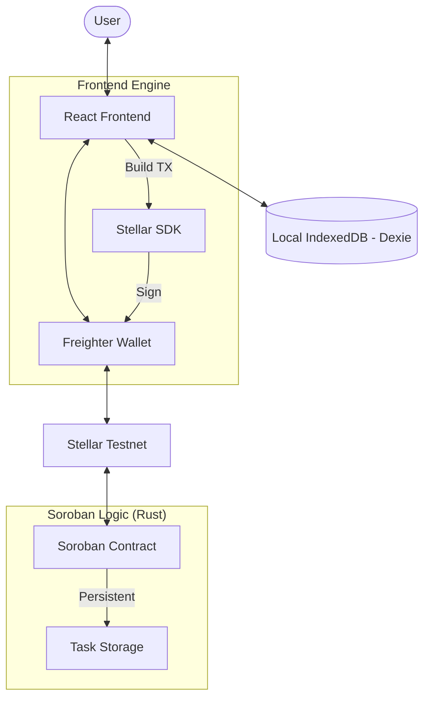

# 🚀 ChainTasks x Stellar (Soroban)

ChainTasks is a premium, personal todo list where tasks are stored immutably on the **Stellar Network** using **Soroban** smart contracts. Optimized for speed with IndexedDB and integrated with the **Freighter Wallet**.

## 🔴 The Problem
Traditional todo lists are fragile and centralized. They lack true ownership and permanent history.

## 🟢 The Solution
**ChainTasks** leverage Stellar's efficient smart contract platform (Soroban) to provide:
- **Immutability**: Tasks are stored on Stellar Testnet permanently.
- **Ownership**: Your tasks are tied to your Stellar Public Key.
- **Performance**: Instant UI updates via **Dexie.js** caching.
- **Low Cost**: Ultra-low transaction fees on the Stellar network.

---

## 🏗️ Architecture



---

## 🛠️ Tech Stack
- **Smart Contracts**: Soroban (Rust SDK)
- **Frontend**: React 19, Vite, TypeScript
- **Styling**: Tailwind CSS, Framer Motion
- **Blockchain SDK**: `@stellar/stellar-sdk`
- **Wallet API**: `@stellar/freighter-api`
- **Local Storage**: Dexie.js (IndexedDB)

---

## 🚀 Getting Started

### Prerequisites
- [Stellar (Soroban) CLI](https://developers.stellar.org/docs/build/smart-contracts/getting-started/setup)
- [Freighter Wallet](https://www.freighter.app/) Browser Extension
- Rust & Cargo installed

### Contract Setup
1. Navigate to `/contracts/todo`:
   ```bash
   stellar contract init todo
   ```
2. Build the contract:
   ```bash
   cargo build --target wasm32v1-none --release
   ```

### Frontend Setup
1. Navigate to `/frontend`:
   ```bash
   npm install --legacy-peer-deps
   ```
2. Update the `CONTRACT_ID` in `src/hooks/useTasks.ts`.
3. Start development:
   ```bash
   npm run dev
   ```

---

## 🧪 Testing Results
The Soroban contract logic was verified through local unit tests:
- `add_task`: Correctly increments counter and pushes to Vec.
- `toggle_task`: Modifies existing task status.
- `delete_task`: Filters out target task by ID.
- `get_tasks`: Retrieves full list for specific address.

---

## 🔗 Project Links
- **Contract ID**: `C...` (Placeholder)
- **Network**: Stellar Testnet
- **Wallet Support**: Freighter Only
