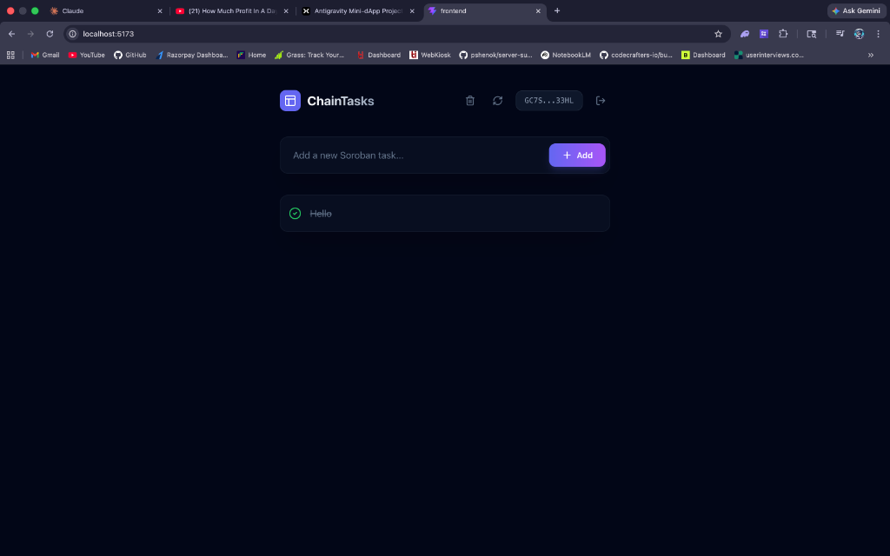
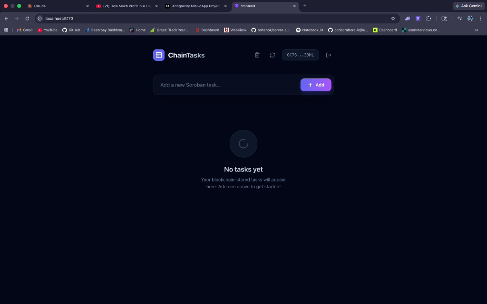
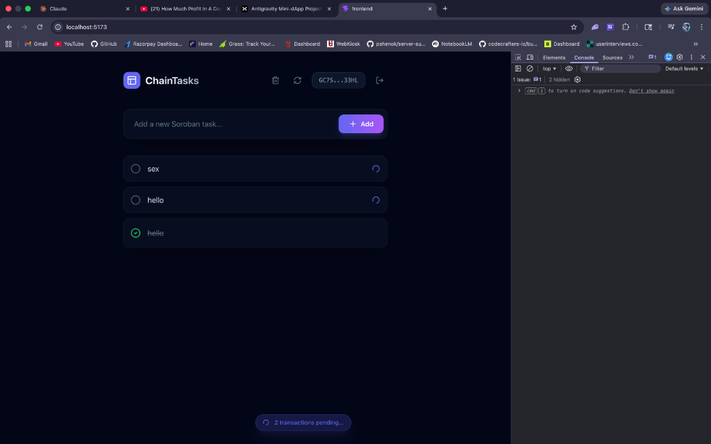

# ChainTasks x Stellar (Soroban)

ChainTasks is a premium, personal on-chain todo list where tasks are stored immutably on the Stellar blockchain. Built with Rust-based Soroban smart contracts and a sleek, modern React frontend, it offers a seamless Web3 experience with optimistic UI updates and persistent offline caching.

## 📺 Project Demo

[Watch the Video Demo](assets/demo.mov)



## 🚀 Key Features

- **Freighter Wallet Integration**: Secure, non-custodial connection using the industry-standard Stellar wallet.
- **On-Chain Persistence**: Tasks are stored in persistent Soroban storage, ensuring your todo list stays immutable.
- **String Support**: Handles spaces, special characters, and long text natively using the Soroban `String` type.
- **Optimistic UI**: Experience zero-latency task management—tasks appear instantly and sync in the background.
- **Local Persistence**: Built with Dexie.js (IndexedDB) to keep your tasks loaded even when offline or during page refreshes.
- **Sync & Recover**: Tooling to clear local cache and force-sync from the blockchain source of truth.

## 🛠️ Technology Stack

- **Smart Contracts**: Rust / Soroban
- **Frontend**: React / Vite / TypeScript
- **Styling**: Tailwind CSS / Lucide Icons / Framer Motion
- **Wallet**: Freighter API
- **Blockchain**: Stellar Testnet
- **Database**: Dexie.js (IndexedDB)

## 🌐 On-Chain Details

- **Contract ID**: `CDNW5EACVDOS3QVSGP76GHCDAOSN7JQW7UYP4ER2VDFGKWXKMN24DO5T`
- **Network**: Stellar Testnet
- **Explorer**: [View Project on Stellar Expert](https://stellar.expert/explorer/testnet/contract/CDNW5EACVDOS3QVSGP76GHCDAOSN7JQW7UYP4ER2VDFGKWXKMN24DO5T)

## 📸 Screenshots

### Wallet Connection


### Real-Time Syncing


## 📦 Getting Started

### Prerequisites

- [Freighter Wallet Extension](https://www.freighter.app/)
- [Node.js v18+](https://nodejs.org/)
- [Stellar CLI](https://developers.stellar.org/docs/build/smart-contracts/getting-started/setup)

### Frontend Setup

1. Navigate to the frontend directory:
   ```bash
   cd frontend
   ```
2. Install dependencies:
   ```bash
   npm install
   ```
3. Start the development server:
   ```bash
   npm run dev
   ```

### Smart Contract Build (Optional)

1. Navigate to the contract directory:
   ```bash
   cd contracts/todo
   ```
2. Build the contract:
   ```bash
   stellar contract build
   ```

## 📄 License

This project is licensed under the Apache-2.0 License.
