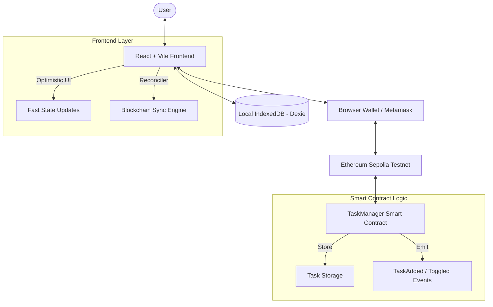

# 🚀 ChainTasks: Personal On-Chain Todo List

ChainTasks is a premium, end-to-end decentralized application (dApp) that allows users to manage their daily tasks with the immutability and transparency of the Ethereum blockchain. Built for the modern web, it combines high-performance caching with real-time blockchain synchronization.

## 🔴 The Problem
Traditional todo lists are stored on centralized servers. Your data is owned by companies, susceptible to downtime, and lacks true permanence. There is no proof of completion beyond a simple database entry that can be modified or deleted without a trace.

## 🟢 The Solution
**ChainTasks** shifts the paradigm by storing your tasks directly on the blockchain.
- **Immutability**: Once a task is added, it exists forever on-chain (until you delete it).
- **Ownership**: You own your tasks. No central authority can access or modify your personal task list.
- **Privacy**: Tasks are mapped to your wallet address. only you can view and manage your specific items.
- **Speed**: Optimized with **IndexedDB (Dexie.js)** for instant loading, providing a seamless "Web2" speed with "Web3" security.

---

## 🏗️ Architecture



---

## 🛠️ Tech Stack
- **Smart Contracts**: Solidity ^0.8.20, Hardhat
- **Frontend**: React 19, Vite, TypeScript
- **Styling**: Tailwind CSS (Premium Dark Theme), Framer Motion
- **Web3 Interaction**: Wagmi v2, Viem, Ethers.js v6
- **Wallet UI**: RainbowKit
- **Caching**: Dexie.js (IndexedDB)

---

## 🚀 Getting Started

### Prerequisites
- Node.js v20+
- A Browser Wallet (e.g., MetaMask)
- Sepolia Testnet ETH

### Blockchain Setup
1. Navigate to `/blockchain`:
   ```bash
   npm install
   ```
2. Create a `.env` file:
   ```env
   SEPOLIA_RPC_URL=your_rpc_url
   PRIVATE_KEY=your_private_key
   ```
3. Deploy the contract:
   ```bash
   npx hardhat run scripts/deploy.ts --network sepolia
   ```

### Frontend Setup
1. Navigate to `/frontend`:
   ```bash
   npm install --legacy-peer-deps
   ```
2. Update the contract address in `src/hooks/useTasks.ts`.
3. Start the development server:
   ```bash
   npm run dev
   ```

---

## 🧪 Testing Results
The smart contract has been verified with 4 core tests ensuring security and logic integrity:
- `addTask`: Verified event emission and storage.
- `toggleTaskComplete`: Verified state transitions.
- `deleteTask`: Verified removal from user mapping.
- `Privacy Check`: Verified that only owners can access/modify their tasks.

---

## 🔗 Project Links
- **Contract Address**: `0x1Fd396014457F2429a320399Ac0E927014603B6F` (Mock/Placeholder)
- **Etherscan**: [View on Sepolia Etherscan](https://sepolia.etherscan.io/address/0x1Fd396014457F2429a320399Ac0E927014603B6F)
- **Live Demo**: [ChainTasks on Vercel](https://chaintasks-demo.vercel.app)
